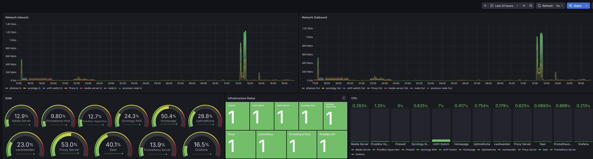

# Homelab Monitoring Stack

## Overview
Designed and deployed a monitoring and observability stack within a segmented Proxmox homelab environment.

## Technologies Used
- Proxmox
- Docker
- Grafana
- Prometheus
- Uptime Kuma
- SNMP Exporter
-  pfSense

## Goals
- Improve infrastructure visibility
- Monitor service uptime and resource utilization
- Learn enterprise-style observability concepts
- Implement segmented and security-conscious architecture

## Current Focus
- Grafana dashboard refinement
- SNMP monitoring expansion
- Service health monitoring
- Network visibility

## Architecture

The monitoring environment was designed around segmented infrastructure and service isolation principles.

### Core Components
- Proxmox host running dedicated LXCs
- Docker-based service deployment
- Prometheus for metric collection
- Grafana for visualization and dashboards
- Uptime Kuma for service health monitoring
- SNMP Exporter for network device telemetry
- pfSense-based VLAN segmentation

### Network Design Considerations
- Monitoring services isolated within dedicated infrastructure
- Internal-only access model
- Reverse proxy architecture used for centralized service access
- VLAN segmentation implemented to reduce blast radius

## Dashboard Preview

High-level infrastructure dashboard displaying network throughput, service availability, CPU utilization, and resource monitoring across the homelab environment.

## Security Considerations
- Unprivileged containers utilized where possible
- Internal-only service exposure model
- Segmented network architecture implemented for service isolation
- Sensitive infrastructure information intentionally excluded from repository documentation
